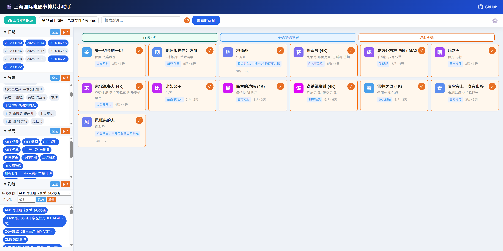
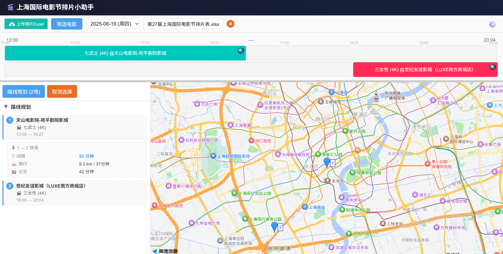
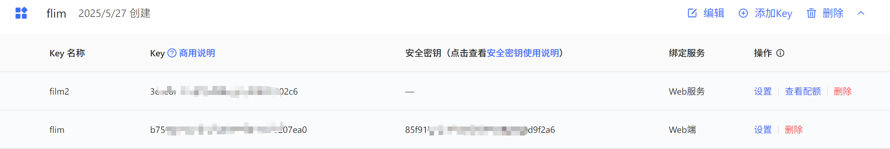
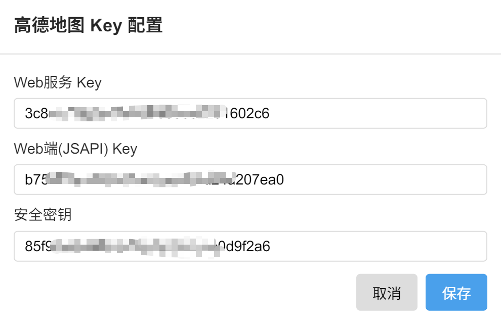

# 🎬 电影节排片小助手

> 一个帮助影迷规划电影节观影行程的 Web 工具，支持上海国际电影节排片表。以后只要上影节的排片excel格式不变，就可以一直使用。(北影节的排片表不带时长，因此不能适用该网页)


## 功能

- **📋 浏览选片** — 按日期、导演、单元、影院等多维度筛选电影，支持搜索片名
- **⏱️ 时间线视图** — 将已选电影按天呈现为甘特图，直观查看时间冲突和场次衔接
- **📍 路线规划** — 自动计算影院间骑行/公交耗时，结合高德地图可视化路线
- **📂 多届数据管理** — 上传/切换/删除不同届次的 Excel 排片表，数据隔离
- **⚡ 快捷搜索** — 双击电影卡片跳转豆瓣搜索，查看影片详情

## 截图


> *选片界面，选择自己感兴趣的电影，可以使得时间轴显示更清爽*


> *时间轴界面，点击可以选片并规划路线*

## 技术栈

| 层 | 技术 |
|---|---|
| 后端 | Python + Flask |
| 前端 | 原生 HTML/CSS/JavaScript |
| 数据 | JSON（由 Excel 解析生成） |
| 地图 | 高德地图 Web API（地理编码、骑行/公交路线规划） |
| 文件上传 | LayUI |
| 依赖管理 | Pixi（conda） |

## 快速开始

### 环境要求

- Python 3.12+
- [Pixi](https://pixi.sh)（推荐）或 conda

### 安装与运行

```bash
# 克隆仓库
git clone https://github.com/GuenyuMieu/SIFFPlanner.git
cd film

# 使用 Pixi 启动（自动创建环境）
pixi run app

# 或使用 pip
pip install flask pandas requests openpyxl
python app.py
```

启动后访问 `http://localhost:5000`。

### 高德地图 API 配置

部分功能（路线规划、距离筛选）需要高德地图 API 密钥：

1. 前往 [高德开放平台](https://lbs.amap.com/) 注册并到控制台应用部分创建应用

> *高德API申请截图，注意绑定服务部分不要选错了*

2. 申请 **Web 服务 API Key** 和 **Web JSAPI Key**
3. 在页面右上角 ⚙️ 设置中填入密钥，或直接编辑 `amap_config.json`

> *将前面申请得到的API依次填入*

> 不配置地图密钥不影响电影浏览和时间线视图功能。

## 使用指南

### 1. 选片

进入页面即可看到所有影片卡片，支持：

- **标签筛选**：点击顶部的日期、导演、单元、影院标签进行筛选
- **距离筛选**：在影院筛选中选择一个中心影院和半径(km)，仅显示该范围内的影院
- **搜索**：搜索框支持按片名模糊搜索
- **加清单**：点击卡片上的 `+` 按钮将影片加入兴趣清单

### 2. 时间线

点击"查看时间线"进入甘特图视图：

- 按日期切换，每部电影的场次显示为彩色长条
- 长条长度正比于影片时长
- 每个影院使用固定颜色标识
- 点击场次加入路线规划（变橙色表示已选中）
- 鼠标悬浮查看详情

### 3. 路线规划

选中 2 个以上场次后，点击"路线规划"：

- 自动检测时间冲突并提示
- 展示每站影院间的换乘信息（时间间隔、骑行距离、公交时长）
- 时间充裕度颜色标识：🔴 < 15min / 🟡 15-30min / 🔵 > 30min
- 高德地图上标注影院位置并绘制骑行路线

### 4. 排片表管理

支持上传 Excel 格式的电影节排片表，文件名需包含"上海国际电影节"。上传后自动解析并刷新数据，可在多个排片表间切换。

## 项目结构

```
film/
├── app.py                    # Flask 后端主程序
├── convert.py                # Excel → JSON 解析器
├── films.json                # 解析后的影片数据
├── amap_config.json          # 高德地图 API 配置
├── current_source.txt        # 当前使用的排片表文件名
├── templates/
│   └── index.html            # 前端单页应用
├── uploads/                  # 上传的 Excel 排片表
├── pixi.toml                 # Pixi 项目配置
└── README.md
```

## API 接口

| 方法 | 路径 | 说明 |
|---|---|---|
| GET | `/` | 渲染主页面 |
| GET | `/api/movies` | 获取影片列表 |
| POST | `/api/timeline_for_movies` | 获取指定影片的时间线数据 |
| POST | `/filter_cinemas` | 按中心影院+半径筛选影院 |
| POST | `/route_info` | 计算影院间路线 |
| GET | `/api/excel_files` | 列出所有排片表文件 |
| POST | `/api/select_excel` | 切换排片表 |
| POST | `/api/delete_excel` | 删除排片表 |
| POST | `/upload_excel` | 上传排片表 |
| GET | `/api/config` | 获取地图 API 配置状态 |
| POST | `/api/config` | 保存地图 API 配置 |

## 数据来源

排片表数据来源于电影节官方公布的 Excel 排片表，本工具仅提供浏览和规划辅助，不包含影片内容本身。

## 许可证

MIT
