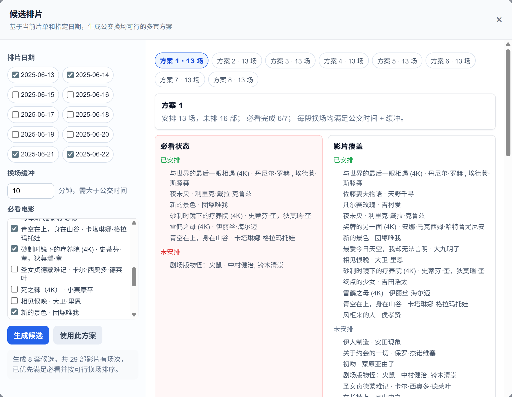
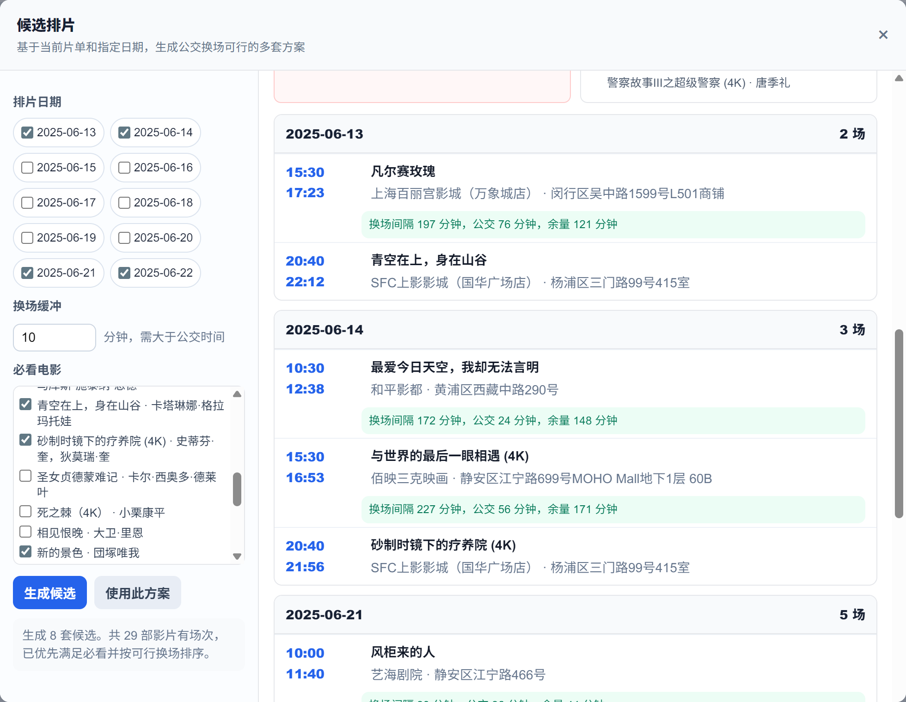
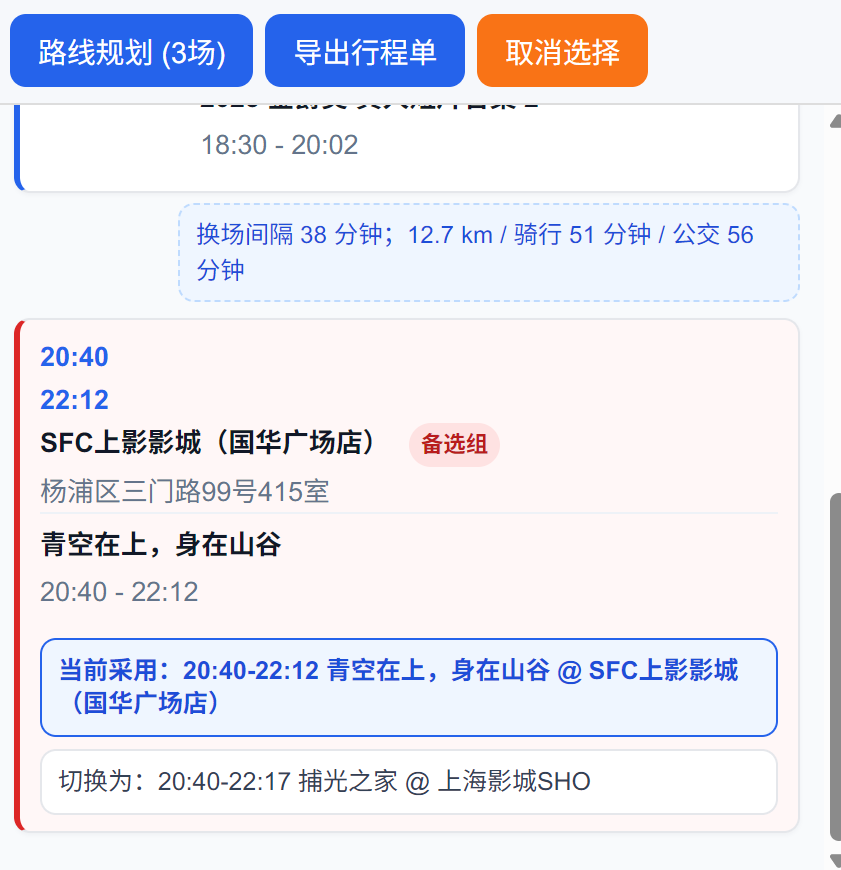

# 🎬 上海国际电影节排片小助手

> 一个帮助影迷规划电影节观影行程的 Web 工具，支持上海国际电影节排片表。只要上影节的排片 Excel 格式不变，就可以一直使用。（有尝试过兼容北影节，但北影节的排片表不带时长，不太能适用该网页）

## 关键内容快速阅读
[安装运行](#安装与运行)
[小白新手运行](#小白运行指南)
[高德API配置](#高德地图-api-配置)
[使用说明](#使用指南)

## 功能

### 📋 影片浏览与多维筛选
- **影片卡片视图** — 以影片为粒度展示所有电影，每张卡片显示片名、导演、单元、场次数和日期跨度
- **多维度标签筛选** — 左侧面板按日期、导演、展映单元、影院四个维度筛选，支持折叠/展开、全选/取消
- **距离筛选** — 选择一个中心影院和半径，仅显示该范围内的影院（需配置高德 API）
- **模糊搜索** — 搜索框支持按片名实时搜索
- **豆瓣快捷搜索** — 双击电影卡片自动跳转豆瓣搜索，查看影片详情

### 🛒 兴趣清单
- **影片收藏** — 点击卡片上的 `+` 按钮将影片加入兴趣清单（类似购物车）
- **清单管理** — 顶部徽章显示已选数量，下拉菜单可逐部移除或一键清空
- **全选/取消筛选** — 一键将当前筛选结果全部加入或移出兴趣清单
- **数据驱动** — 兴趣清单是后续时间线和候选排片的数据基础

### ⏱️ 时间线视图
- **甘特图展示** — 将兴趣清单中的影片按天呈现为时间线，每个场次为彩色长条
- **颜色区分** — 每个影院使用哈希颜色标识，直观区分不同影院的场次
- **时间比例** — 长条长度和位置正比于影片时长和开映时间
- **跨日显示** — 超过 24:00 的场次标注为"次日"
- **场次选择** — 点击场次加入路线规划（黑色虚线边框表示已选中）
- **其他排期弹窗** — 点击 🔍 按钮查看同一影片的所有其他场次
- **可拖拽分隔** — 时间线与下方面板之间的分隔条可自由拖动调整

### 🤖 候选排片（智能排片，需配置高德KEY）
- **自动生成方案** — 基于兴趣清单，使用 beam search 算法自动生成多套可行的观影方案
- **必看标记** — 可将部分影片标记为"必看"，算法优先安排必看影片
- **公交时间校验** — 每套方案实时调用高德公交换乘 API，确保影院间换场时间充足
- **缓冲时间可配** — 支持自定义换场缓冲时间（默认 10 分钟）
- **方案对比** — 多套方案按场次数量、必看覆盖率、空闲时间排序，可切换查看
- **覆盖分析** — 展示每套方案的已排/未排影片、必看完成状态
- **一键应用** — 选择满意的方案后一键导入到当前行程

### 📍 路线规划
- **骑行路线** — 调用高德骑行 API 计算影院间骑行距离和耗时
- **公交路线** — 调用高德公交换乘 API 计算公交耗时
- **地图可视化** — 在高德地图上标注影院位置和骑行路线
- **换乘信息** — 路线面板展示每段接驳的间隔时间、距离、骑行/公交耗时

### 🔀 时间冲突处理
- **自动检测** — 选中场次自动检测同一天的时间重叠
- **备选切换** — 重叠场次自动归入"备选组"，支持一键切换不同场次
- **同影院合并** — 连续同一影院的场次自动合并为一个访问点

### 📝 行程单导出
- **文本导出** — 将当前行程导出为格式化的 `.txt` 文件
- **完整信息** — 包含日期、场次、影院、地址、换乘间隔和备选方案

### 📂 多届排片表管理
- **上传解析** — 通过 LayUI 上传组件上传 Excel 排片表，自动解析为 JSON
- **切换与删除** — 顶部下拉菜单快速切换或删除已上传的排片表
- **自动加载** — 启动时自动扫描 `uploads/` 目录，优先加载最新的电影节文件
- **智能年份** — 自动从文件名提取届数（如"第27届上海国际电影节"→ 第27届），推断年份
- **列名兼容** — 支持多种 Excel 列名变体（如"片名"/"影片名称"/"电影名称"）

### ⚙️ 高德地图配置
- **Web 界面配置** — 右上角 ⚙️ 设置中填写 Web 服务 Key、JSAPI Key 和安全密钥
- **本地持久化** — 配置保存至 `amap_config.json`，下次启动自动加载
- **功能降级** — 未配置密钥时，浏览和时间线功能不受影响，仅地图相关功能不可用

## 截图


> *选片界面 — 左侧多维度筛选，右侧影片卡片，点击 + 加入兴趣清单*



> *智能排片界面，根据感兴趣的电影和日期智能排片*


> *时间轴界面 — 上部甘特图，下部行程面板 + 地图*


> *备选行程 — 时间冲突的场次可一键切换*

## 技术栈

| 层 | 技术 |
|---|---|
| 后端 | Python 3.14 + Flask |
| 前端 | 原生 HTML/CSS/JavaScript（单页应用） |
| 数据 | JSON（由 Excel 经 Pandas 解析生成） |
| 地图 | 高德地图 JSAPI 2.0 + Web 服务 API（地理编码、骑行/公交路线规划） |
| 文件上传 | LayUI 2.11.5 |
| Excel 解析 | Pandas + openpyxl |
| 依赖管理 | [Pixi](https://pixi.sh) |

## 快速开始

### 环境要求

- Python 3.12+
- [Pixi](https://pixi.sh)（推荐）或 conda

### 安装与运行

```bash
# 克隆仓库
git clone https://github.com/GuenyuMieu/SIFFPlanner.git
cd SIFFPlanner

# 使用 Pixi 启动（自动创建环境并安装依赖）
pixi run app

# 或使用 pip 手动安装
pip install flask pandas requests openpyxl
python app.py
```

启动后访问 `http://localhost:5000`。

## 小白运行指南

点击下方展开查看超详细的小白安装与运行教程(还有不懂的就复制文字找个AI问问)：

<details>
<summary><b>展开查看超详细运行指南（包含 Python 安装步骤）</b></summary>

## SIFFPlanner（电影节排片助手）超详细小白运行指南

这份指南将手把手带你把 **SIFFPlanner** 项目在电脑上运行起来。无论你是技术小白，还是第一次接触代码，只需跟着下面的步骤一步步操作即可。

---

## 目录

1. [第一步：获取项目代码]
2. [第二步：准备 Python 环境（超详细）]
3. [第三步：安装依赖并运行]
4. [第四步：如何访问与关闭]

---

## 第一步：获取项目代码

我们有两种方法把项目下载到电脑里，**选择其中一种即可**：

### 方法 A：直接下载压缩包（最推荐 ⭐️）

1. 打开项目网页，找到页面中上部右侧绿色的 **`<> Code`** 按钮。
2. 点击它，在弹出的菜单里点击 **`Download ZIP`**。
3. 下载完成后，解压该压缩包。
4. 打开压缩包解压后的文件夹，你会看到一个名为 `SIFFPlanner-main` 的文件夹，**双击进入这个文件夹**。

### 方法 B：使用 Git 克隆（适合装了 Git 的同学）

打开你的终端（Terminal），依次运行以下命令：

```bash
git clone https://github.com/GuenyuMieu/SIFFPlanner.git
cd SIFFPlanner

```

---

## 第二步：准备 Python 环境（超详细）

如果你打算使用 Pixi 启动，可以跳过这一步。如果你打算使用传统的 `pip` 方式，请确保电脑上安装了 Python。

### 1. 下载 Python

1. 打开 Python 官方下载页面：[python.org/downloads](https://www.python.org/downloads/)。
2. 点击网页上醒目的黄色按钮 **`Download Python 3.1x.x`**（通常会自动识别你的电脑系统）。

### 2. 安装 Python（⚠️ 关键步骤）

#### 🔹 Windows 系统安装：

1. 双击打开刚刚下载好的 `.exe` 安装程序。
2. **非常重要：** 在弹出的安装窗口底部，**务必勾选 “Add python.exe to PATH”**（将 Python 添加到环境变量）。*如果不勾选这一项，后面输入命令时电脑会报错找不到 Python！*
3. 勾选后，点击上方的 **`Install Now`**（现在安装）。
4. 等待进度条走完，看到 “Setup was successful” 后，点击 `Close` 关闭窗口。

#### 🔹 Mac 系统安装：

1. 双击打开下载好的 `.pkg` 安装包，一路点击“继续”和“同意”，最后点击“安装”。
2. 安装完成后，Mac 会自动弹出一个 Python 文件夹窗口，直接关闭即可。

### 3. 验证是否安装成功

1. **打开终端**：
* **Windows**：按下键盘上的 `Win + R` 键，输入 `cmd` 后回车。
* **Mac**：按下 `Command + 空格键` 打开聚焦搜索，输入“终端”或 `Terminal` 后回车。


2. 在弹出的黑窗口中，输入以下命令并回车：
* **Windows 用户输入**：
```bash
python --version

```


* **Mac 用户输入**：
```bash
python3 --version

```


3. **结果判断**：如果窗口输出了类似 `Python 3.12.x` 的字样，说明安装成功！

---

## 第三步：安装依赖并运行

现在回到你第一步下载好的 `SIFFPlanner`（或 `SIFFPlanner-main`）文件夹中。

### 快捷入口：如何在文件夹中打开终端？

* **Windows**：在文件夹空白处**按住 Shift 键并点击鼠标右键**，选择“在此处打开 PowerShell 窗口”或“在终端中打开”。
* **Mac**：在文件夹空白处点击右键，选择“新建位于文件夹的终端窗口”。

---

根据你的喜好，选择以下**路线一**或**路线二**其中一种方式启动：

### 路线一：使用 Pixi 启动（最省心 🚀）

> *如果你电脑里安装了现代环境管理工具 Pixi，它会自动帮你搞定 Python 和所有依赖，不需要手动安装任何东西。*

在刚才打开的终端窗口中，直接输入以下命令并回车：

```bash
pixi run app

```

---

### 路线二：使用传统 Pip 安装（最通用 🛠️）

> *如果你刚才手动安装了 Python，请使用这个方法。*

1. **安装运行所需的依赖（大白话：安装插件）**
在终端中复制并运行以下命令（Mac 用户如果遇到权限问题，可将 `pip` 改为 `pip3`）：
```bash
pip install flask pandas requests openpyxl

```


*等待进度条走完，且没有出现红色的报错（ERROR），说明插件安装成功。*
2. **启动程序**
接着输入下面这行命令并回车：
```bash
python app.py

```


*(Mac 用户如果上一步用了 python3，这里也请使用 `python3 app.py`)*

---

## 第四步：如何访问与关闭

### 1. 怎么知道成功了？

当你运行启动命令后，终端窗口内会滚动刷新出几行字，最后停留在类似下面的提示上：

```text
 * Serving Flask app 'app'
 * Debug mode: on
 * Running on http://127.0.0.1:5000

```

看到 `http://127.0.0.1:5000` 就代表程序已经成功在本地跑起来了！

### 2. 开始使用

1. **千万不要关闭这个终端窗口**，关掉它程序就会停止。
2. 打开你电脑上的任意浏览器（如 Chrome、Edge、Safari 等）。
3. 在上方地址栏输入：`http://127.0.0.1:5000` 然后按下回车。
4. 现在，你就可以在网页里使用你的电影节排片助手了！（规划路线和排片功能记得配置高德API，配置方法在下面。）

### 3. 如何关闭

不想使用时，回到那个运行着代码的终端窗口，同时按下键盘上的 **`Ctrl + C`** 键，程序就会安全停止。随后关闭黑窗口即可。

</details>

### 高德地图 API 配置

部分功能（路线规划、候选排片换场校验、距离筛选）需要高德地图 API 密钥：

1. 前往 [高德开放平台](https://lbs.amap.com/) 注册并创建应用(直接支付宝或者淘宝扫码登陆)
2. 申请以下密钥：

   | 密钥类型 | 用途 | 绑定服务 |
   |---|---|---|
   | Web 服务 API Key | 后端地理编码、骑行/公交路线查询 | Web 服务 API |
   | Web 端(JSAPI) Key | 前端地图显示与交互 | Web 端 |

   

3. 在页面右上角 ⚙️ 设置中填入密钥，或直接编辑 `amap_config.json`：

   ```json
   {
     "amap_key": "您的Web服务Key",
     "amap_jsapi_key": "您的JSAPI Key",
     "amap_security_code": "您的安全密钥"
   }
   ```

   

> 💡 不配置地图密钥不影响电影浏览和时间线视图，仅地图、路线规划、候选排片和距离筛选功能不可用。

## 使用指南

### 第一步：上传排片表

1. 点击顶部 **「上传排片Excel」** 按钮，选择从电影节官网下载的 Excel 排片表
2. 文件名需包含 **"上海国际电影节"**，系统会自动解析并刷新数据
3. 如需切换不同届次的排片表，点击顶部下拉菜单选择或上传新文件

### 第二步：浏览与选片

1. 在左侧筛选面板中按日期、导演、单元、影院筛选影片
2. 使用搜索框按片名模糊搜索
3. 点击影片卡片上的 **`+`** 按钮将感兴趣的影片加入清单
4. 顶部徽章显示已选影片数量，点击可查看和管理清单
5. 双击卡片可跳转豆瓣搜索影片详情

### 第三步：候选排片（可选）

点击 **「候选排片」** 按钮：

- 选择想要观影的**日期**（可多选）
- 设置**换场缓冲时间**（默认 10 分钟，需大于公交耗时）
- 在必看列表中**勾选必须观看的影片**
- 点击「生成候选」，系统自动计算满足公交换场时间的多套方案
- 切换查看不同方案，点击「使用此方案」一键导入当前行程

### 第四步：查看时间线

点击 **「查看时间轴」** 进入甘特图视图：

- 使用顶部下拉框切换日期
- 每个影院用不同颜色标识
- 长条长度正比于影片时长
- 鼠标悬浮查看场次详情
- 点击 🔍 按钮查看该片的其他排期

### 第五步：路线规划

1. 在时间线上**点击场次**选中（显示黑色虚线边框）
2. 选中 2 个以上有效场次后点击 **「路线规划」**
3. 系统自动检测时间冲突，重叠场次归入备选组
4. 点击备选按钮可在冲突场次间切换
5. 路线信息面板展示每段接驳的骑行距离和公交耗时
6. 地图上可视化骑行路线

### 第六步：导出行程单

点击 **「导出行程单」** 将当前行程保存为 `.txt` 文件，包含完整的场次安排、换乘信息和备选方案。

## 项目结构

```
film/
├── app.py                    # Flask 后端主程序（路由、API、数据处理）
├── convert.py                # Excel → JSON 解析器（列名规范化、年份自动识别）
├── films.json                # 解析后的影片数据（由 convert.py 生成）
├── amap_config.json          # 高德地图 API 配置（用户填写）
├── current_source.txt        # 当前使用的排片表文件名记录
├── pixi.toml                 # Pixi 项目配置（Python 3.14 + 依赖）
├── templates/
│   └── index.html            # 前端单页应用（浏览、时间线、路线规划、候选排片）
├── uploads/                  # 上传的 Excel 排片表
├── figures/                  # README 截图
└── README.md
```

## API 接口

| 方法 | 路径 | 说明 |
|---|---|---|
| GET | `/` | 渲染主页面，传入时间线数据、影片列表和地图配置 |
| GET | `/api/movies` | 获取去重后的影片列表（含场次、影院、日期） |
| POST | `/api/timeline_for_movies` | 根据影片 key 列表获取筛选后的时间线数据 |
| POST | `/api/schedule_candidates` | 生成候选排片方案（beam search + 公交换场校验） |
| POST | `/route_info` | 计算影院间骑行/公交路线信息 |
| POST | `/filter_cinemas` | 按中心影院 + 半径（km）筛选范围内的影院 |
| GET | `/api/excel_files` | 列出 `uploads/` 下所有 Excel 文件 |
| POST | `/api/select_excel` | 切换当前使用的排片表 |
| POST | `/api/delete_excel` | 删除指定排片表（自动切换或清空数据） |
| POST | `/upload_excel` | 上传 Excel 排片表（LayUI 文件上传） |
| GET | `/api/config` | 获取高德 API 配置状态 |
| POST | `/api/config` | 保存高德 API 配置 |

## 核心算法

### 候选排片（Beam Search）

候选排片使用 beam search 算法在选定日期的所有场次中搜索可行排列：

1. **状态表示**：每个状态包含已排场次列表、已排影片集合、接驳信息和总空闲时间
2. **剪枝策略**：按时间顺序遍历场次，对每个状态尝试追加未排影片的下一个可行场次
3. **可行性约束**：
   - 同一影片不可重复排入
   - 同一天内后续场次开始时间必须晚于前一结束时间 + 公交换乘时间 + 缓冲时间
   - 通过高德公交换乘 API 实时获取影院间耗时
4. **Beam 去重**：相同场次序列的状态去重保留一份
5. **排序规则**：优先级 — 必看覆盖率 > 场次数 > 空闲时间少 > 结束时间早
6. **Beam 宽度**：90，候选输出上限 12

### Haversine 距离筛选

使用 Haversine 公式计算球面两点距离，按用户指定的半径筛选地理位置附近的影院。

## 数据来源

排片表数据来源于上海国际电影节官方公布的 Excel 排片表，本工具仅提供浏览和规划辅助，不包含影片内容本身。

## 许可证

MIT
